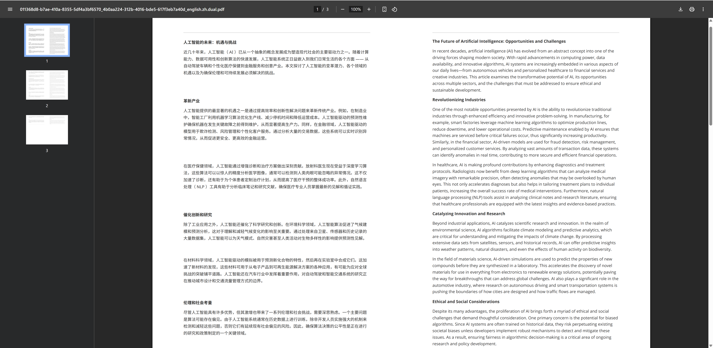
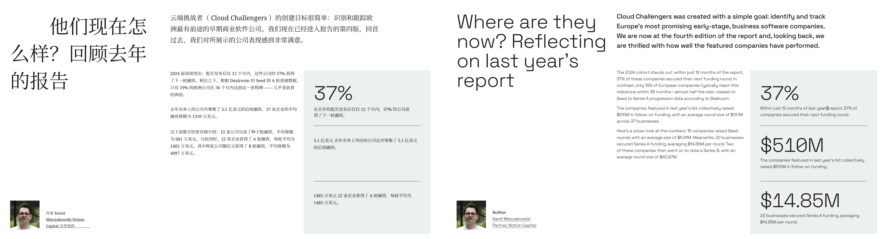
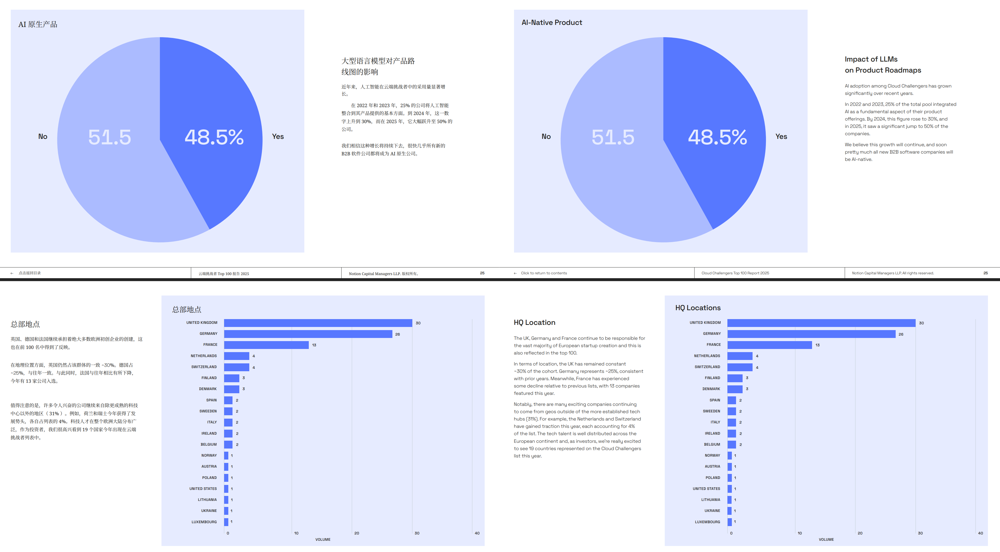

# 📄 BabelDOC Gradio UI

This is a Gradio-based graphical interface for the [BabelDOC](https://github.com/funstory-ai/BabelDOC) project, designed to provide a more user-friendly and convenient local PDF translation experience.

Supported model sources:

- 🌐 OpenAI (GPT-3.5 / GPT-4 / GPT-4o, etc.)
- 🔍 DeepSeek
- 🖥️ Local Ollama models (e.g., Qwen, Gemma, LLaMA3, etc.)

------

## 🚀 Features

- 📤 Upload a PDF file and automatically translate
- 🔄 Freely switch between model sources (OpenAI / DeepSeek / Ollama)
- 📌 Customize API base URL and model name
- 📗 Support bilingual/monolingual output, watermark removal
- ⚙️ Configurable options: minimum text length, compatibility enhancements
- 🧩 Decoupled from BabelDOC core, can be used independently

------

## 🛠️ Installation

### 🧪 From source:

#### 1. Clone the repository

```bash
git clone https://github.com/chaorenai/babeldoc-ui.git
cd babeldoc-ui
```

#### 2. Install dependencies

It is recommended to use a virtual environment such as `conda` or `venv`:

```bash
# Create virtual environment (optional)
python -m venv venv
venv\Scripts\activate  # On Windows

# Install dependencies
pip install -r requirements.txt
```

#### 3. Run the application


```bash
python app.py
```

Your browser will automatically open: [http://127.0.0.1:7860](http://127.0.0.1:7860/)

### 🐳 Using Docker Compose:

#### 1. Clone the repository
```bash
git clone https://github.com/chaorenai/babeldoc-ui.git
cd babeldoc-ui
```
#### 2. Run with Docker Compose

```bash
docker-compose up -d 
```

Then you can open the link [http://127.0.0.1:7860](http://127.0.0.1:7860) in your browser.

## ⚙️ BabelDOC Installation

This UI depends on the [BabelDOC](https://github.com/funstory-ai/BabelDOC) CLI tool to perform actual translation. You can install it via either of the following ways:

### ✅ Recommended: via `uv`

```bash
uv tool install --python 3.12 BabelDOC
```

### 🧪 From source:

```bash
git clone https://github.com/funstory-ai/BabelDOC
cd BabelDOC
pip install -e .
```

After installation, you can run `babeldoc` directly in your terminal.

------

## 🖼️ Demo (Right side is original, left side is translated)


 
 
 
 

------

## 🧠 Usage Tips

- When using local models (Ollama), make sure they are already running:

  ```bash
  ollama run qwen:7b
  ```

- If you don’t have an OpenAI API key, consider registering at DeepSeek or other OneAPI providers.

- If the translated PDF becomes too large, disable bilingual output or try adjusting `--min-text-length`.

------

## 📜 License

This project is open-sourced under the [MIT License](https://chatgpt.com/c/LICENSE). Feel free to fork and customize.

------

## 🙋‍♀️ Contact & Support

For technical issues or feature requests, please submit an Issue or contact the author:

```
Author: xiaodu  
Email: chaoren@duck.com  
X (formerly Twitter): https://x.com/xiaodus
```

> ⚠️ This project only provides a UI layer; the core translation logic belongs to the official BabelDOC project.

